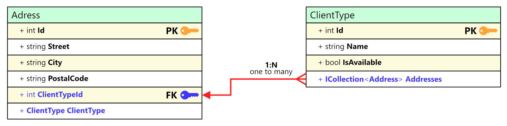

# 🚀 Blazor CRUD Application with EF Core and MudBlazor


A modern, responsive Blazor Server application demonstrating CRUD operations using Entity Framework Core, MudBlazor UI components, and clean architecture principles.





## ✨ Key Features

- **📊 Client Type Management**
  - CRUD operations with real-time validation
  - Availability status tracking with visual indicators
  - Integrated address count monitoring
  - Prevents deletion of types with associated addresses

- **📫 Address Management**
  - Full CRUD functionality
  - Client type association
  - Polish postal code validation (XX-XXX format)
  - Real-time form validation

## 🛠️ Tech Stack

- **.NET 9.0**
- **Blazor Server**
- **Entity Framework Core 9.0.1**
- **SQLite Database**
- **MudBlazor Components**
- **FluentValidation**

## 📦 Key Dependencies

```xml
<PackageReference Include="FluentValidation" Version="11.11.0" />
<PackageReference Include="Microsoft.EntityFrameworkCore.Sqlite" Version="9.0.1" />
<PackageReference Include="MudBlazor" Version="8.*" />
<PackageReference Include="MudBlazor.ThemeManager" Version="3.0.0" />
```

## 🏗️ Architecture

The application follows clean architecture principles with distinct layers:

- **Domain Layer**: Core business logic and entities
- **Infrastructure Layer**: Data access and external services
- **Presentation Layer**: Blazor components and UI logic

### Design Patterns

- **Repository Pattern**: Generic implementation for data access
- **Unit of Work**: Transaction management and data consistency
- **CRUD Operations**: Asynchronous implementation with error handling

## 🚀 Getting Started

1. **Clone the repository**
```bash
git clone https://github.com/krzysztofautomatyk/BlazorEFApp
```

2. **Restore dependencies**
```bash
dotnet restore
```

3. **Update database**
```bash
dotnet ef database update
```

4. **Run the application**
```bash
dotnet run
```

## 📋 Prerequisites

- .NET 9.0 SDK
- SQLite
- Visual Studio 2022 or VS Code

## 🎯 Features in Detail

### Client Type Management
- Create and edit client types
- Toggle availability status
- Visual status indicators using MudBlazor Chips
- Address count tracking
- Deletion protection for types with addresses

### Address Management
- Full CRUD operations
- Association with client types
- Postal code validation (XX-XXX format)
- Form validation using FluentValidation

### UI Features
- Responsive data tables
- Search and filtering
- Pagination
- Theme customization
- Toast notifications
- Dialog confirmations

## 🤝 Contributing

Contributions are welcome! Please feel free to submit a Pull Request.

## 📄 License

This project is licensed under the MIT License - see the LICENSE file for details.

## 🙏 Acknowledgments

- MudBlazor Team for the amazing UI components
- Entity Framework Core Team
- Blazor Community

---
